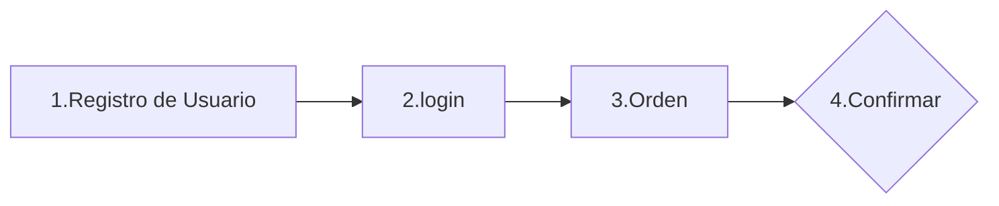
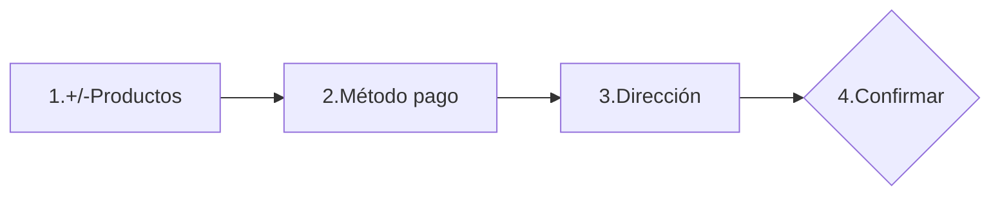
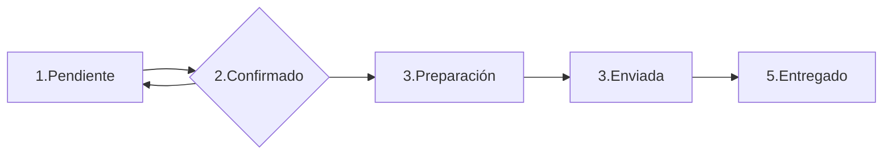

# Guía de uso de la REST API para ordenes de Delilah Restó.
***Sprint Project 2. ***

## ¿Qué permite hacer esta API para Delilah Restó?
Esta API está diseñada para la gestión de las ordenes del restaurante Delilah Restó. Los usuarios podrán registrarse para poder ordenar sus ordenes en Delilah Restó para facilitarles a ellos una efectiva toma de la orden deseada de cada usuario y así garantizar una positiva experiencia de usuario en Delilah Restó.

## ¿Qué tecnologías contiene esta API?
Esta API está realizada en el lenguaje de Javascript, se utiliza el framework Node JS, las librerías de Express, express basic auth y Swagger como visualizador de la documentación hecha en API versión 3.0.

 ## ¿Cómo se logean/autentican los usuarios registrados?

La autenticación del usuario lo hará con su **correo** y **contraseña** suministrados en su registro.  Debe autenticarse en el endpoint de **login** de la ruta de registro y en las rutas a través del método de **basic auth** que aparece con un **candado** en la visualización de la documentación del proyecto en Swagger; si no lo hace, no podrá completar ni ver el historial de sus ordenes.

Tipos de usuarios: 

-  **Usuario Admin:** puede acceder a todos los endpoints y puede hacer la gestion de las rutas de *productos*, *usuarios,* *métodos de pago* y  la *gestión de los estados de las ordenes* ya confirmadas.

-  **Usuarios No Admin:** puede crear su usuario en la ruta de registro, logearse y hacer ordenes en la ruta de ordenes. Nota: en los estados de las ordenes solo puede ***confirmar las ordenes***.

Dado la aclaración de acceso, si el **usuario no admin**  trata de acceder a las rutas de administrador, tendrá una respuesta de ***no autorizado***. Si  dese acceder a las rutas de administración, debe hacerlo a través del **usuario admin** con el siguiente siguiente correo (username) y contraseña:

>  **Username**: delilah@gmail.com
>  **Password**: 12345

## Inicio de la API

Para iniciar la API, guarda la carpeta con los archivos "SprintProject1" y  reinstala todas las librerías necesarias que se requieren para funcionar la API y así poder visualizar la documentación de esta misma desde Swagger. 

Primero, debes ubicarte en la terminal, sea la de Visual Studio Code, gitbash, powershell, etc; debes verificar que estes en el mismo directorio o carpeta donde está la API e iniciar el proceso de instalación de las librerias de nodeJS con el siguiente comando:

    npm install

Si la instalación fue exitosa, ya está listo la API para iniciar el servidor, por lo cual, puedes iniciarlo con el siguiente comando en la terminal.

    nodemon src/index.js 

Luego que hayas iniciado exitosamente el servidor, puedes ir a esta ruta para visualizar la documentación de la API desde Swagger. Para esto, desde tu navegador copia y pega el siguiente enlace para que puedas visualizar dicha documentación: http://localhost:3000/swagger

Si pudiste exitosamente visualizar toda la documentación de la API, puedes probar ahora la API

# Documentación en Suagger de la API

En esta documentación hay 6 rutas, el rol de **Usuario No Admin** o cliente de Delilah Restó, solamente puede tener acceso las rutas de **Registro** y **Orden**, el resto de rutas son de acceso y gestión del **Usuario Admin**.

El proceso para que un usuario pueda obtener los productos a través de la APi inicia desde su registro en la API y luego se logean para poder realizar y confirmar sus ordenes (ver ilustración 1).

***Ilustración 1. Proceso para orden de usuarios***

El proceso de la **orden** inicia (como se ve en la ilustración 2) agregando o eliminando productos de la orden, luego debe ingresar el método de pago, rectificar la dirección de envío y por último, confirmar la orden para luego ser preparada, enviada y entregada al usuario.

***Ilustración 2. Proceso de las Ordenes***

Existen 5 tipos de estados para cada una de las ordenes  (ver ilustracion 3), de los cuales solo se le permite al usuario no admin pasar del estado **pendiente** a **confirmado**, los otros estados son gestionados por el usuario admin en la orden.

***Ilustración 3. Proceso de las Ordenes***

Además, como se evidencia en las ilustraciones 1 y 2, en ningún momento se le pide al usuario **crear** una **orden**,  esto es porque el usuario desde que se registra tiene una orden vacía donde podrá hacer su primera orden. Cuando **confirma** su orden para ser enviada y luego entregada, automáticamente se crea otra orden vacía co estado **pendiente**. Para esto último vale aclarar que es posible bajo la premisa de que cada usuario contará con una orden en ***estado pendiente*** (cuando se registra y cuando confirma una orden).

## Rutas de Acceso
A continuación se hará una guía de uso de cada una de las rutas y sus respectivas endpoints en relación con la documentación hecha en Swagger:

### [Registro](http://localhost:3000/swagger/#/Registro)
En esta ruta no es necesario logearse, es solo para registro del usuario. Vale aclarar que el nombre de usuario/username para el acceso a la cuenta es con el correo electrónico del usuario cuando se registró.

1. **GET: /registro**: este endpoint es sencillo y solo le da la bienvenida al usuario a registrarse.
 2.  **POST: /registro**: permite registrar con el ejemplo que aparece en la Request Body y debe llenar todos los campos que allí aparecen.  Si el email existe o hay elementos faltantes en el requerimiento, obtendrá una respuesta con estatus 400 advirtiendo que ya existe el email o los requerimientos están incompletos. El modelo de Json requerido en el body es:
			 

		        { 
				      "email": "prueba@gmail.com",   
				     "name": "Prueba Alberto Ejemplo", 
				     "tel": 5198811,  
				     "adress": "calle 111",   
				      "password": "12345"
			    }	   
3. **POST: /registro/login**: permite a los usuarios acceder a su cuenta a través de su email y contraseña. Si es incorrecto, obtendrá una respuesta con estado 400, y si no ingresa alguno de los dos valores, también obtendrá un estado 400 indicando que tienen requerimientos incompletos.

 ### [Orden](http://localhost:3000/swagger/#/Orden/)
 En esta ruta es importante logearse antes de iniciar el proceso de la orden. finaliza el proceso de la orden cuando confirma la orden, sin embargo, puede continuar en la ruta realizando nuevas ordenes.

> **Nota 1:** verificar estar logeado con **correo** (username) y **contraseña** desde el **candado** de **basic auth** en la visualización de swagger de esta ruta, de lo contrario no podrá acceder a ella.

> **Nota 2:** los accesos a visualizar **métodos de pago**  y **productos** son para que el usuario logeado **no admin** pueda saber qué decisiones tomar, la administración de estos están en otras rutas y estos usuarios no pueden tener autorización en ellos.

 1. **GET:/orden**: este endpoint te trae la orden actual del usuario logeado que está en estado pendiente.
 2. **GET:/orden/prductos**:  trae todos los productos disponibles para agregar en la orden.
 3. **GET:/orden/prductosorden**: trae todos los productos que estan dentro de la orden actual que el usuario logeado está realizando.
 4. **POST:/orden/prductosorden/{id}**: Esta ruta posibilita al usuario agregar los productos a la orden ingresando  como requerimiento por parámetros el id del producto de la lista de productos ofertados por Delilah Restó . Al agregar más de una vez un mismo producto con su mismo id, se suma las cantidades en el elemento **¨q¨** de cada producto dentro de la orden.  Si ingresas un producto no existente, obtendrá una respuesta con estado 400 anunciando que no existe el producto con id requerido.
 5. **DELETE:/orden/prductosorden/{id}**: Al igual que el endpoint del numeral 5, este está relacionados con los productos dentro de la orden pero en este caso, para eliminarlos a través del requerimiento con los parámetros del id del producto que está en la orden. Si existe un elemento con una cantidad mayor a 1 no lo eliminará sino que disminuirá la cantidad del mismo producto en su elemento **¨q¨**. Así también,  si ingresa un número de id no existente en ela orden, obtendrá el usuario una respuesta con estado 400 anunciando que el id con el producto requerido no existe en la orden. 
 6. **GET:/orden/metodospago**: Luego del proceso de agregar la orden deseada por el usuario, puede elegir un método de pago, por esto, este get permite al usuario observar antes de tomar la decisión poder visualizar los métodos de pago disponibles en Delilah Restó.
 7. **PUT:/orden/metodospago/{id}**: Si el usuario se ha decidido por cual método de pago, puede ingresar a este endpoint donde el usuario deberá escoger dicho método de pago a través de un requerimiento por los parámetros del id del método de pago a relacionar. SI no existe el método de pago con el id requerido, obtendrá una respuesta con estado 400 alertando que no existe ese método de pago.
 8.   **PUT:/orden/cambiodireccion**: en este endpoint ell usuario puede modificar la dirección que viene por defecto desde su información de registro de usuario. En este es necesario que responda dentro del elemento del JSON entrecomillas para evitar errores con el mismo. 

			{"adress": "string"}

 9. **PUT:/orden/confirmarorden**: este es el último paso para que la orden del usuario sea procesado y luego entregado. La respuesta solo consta de un **sí** o un **no** para confirmar la orden que el usuario realizó a través de un requerimiento en el body (ver modelo a continuación). Se debe tener en cuenta que si envía solicitud de confirmación de la orden sin ningún producto, no lo permitirá proceder a confirmar la orden y obtendrá una respuesta con estado 400 anunciando que no tiene productos en la orden; así también, si requiere de una respuesta diferente a sí /no, obtendrá una respuest con estado 400 anunciando que la respuesta es incorrecta . Como ya se habia mencionado, en esta confirmación trae consigo que se cree otra orden vacía en estado pendiente. 

			{"state": "si/no"}

 10. **GET:/orden/historial**: este endpoint permite al usuario revisar el historial de todas las ordenes que aparecen relacionados a su cuenta de usuario en la la API.

### [Gestión de Ordenes](http://localhost:3000/swagger/#/Gesti%C3%B3n%20de%20Ordenes)
Esta ruta está diseñada para la gestión de los estados de las ordenes luego de estar confirmados. Solo se tiene acceso a **usuarios admin**, de lo contrario tendrá una respuesta con estado 400 denegando el acceso a esta ruta.

> **Nota:** verificar estar logeado con **correo** (username) y **contraseña** desde el **candado** de **basic auth** en la visualización de swagger de esta ruta, de lo contrario no podrá acceder a ella.

 1. **GET:/admin/orders**: este endpoint devuelve todos las ordenes de todos los usuarios.
 2. **GET:/admin/ordersstates**: este endpoint trae los diferentes estados que pueden tener las ordenes para que el usuario adminsitrador pueda seleccionar la orden a gestionar su estado.
 3. **GET:/admin/ordersstates/{id}/state/{idState}**: en este caso el usuario admin requiere a través de dos parametros el id **(id)** de la orden que desea modificar suestado y el id del estado **(idState)** que desea asociar a la orden seleccionada. Es importante aclarar que para efectos de mantener estable el sistema de una solo orden de usuario en estado pendiente, este endpoint tiene dos reestricciones: que el admin no puede devolver una orden a estado ¨Pendiente¨ ni tampoco, puede modificar una orden con estado ¨Pendiente¨ a otro estado; si se incurre en estos dos errores, el usuario admin obtendrá una respuesta con estado 400 anunciando que no le es permitido modificar la orden en estado pendiente o no puede devolver el pedido en estado Pendiente. Igualmanera, si el usuario admin ingresa un id de orden o id de estado no existente, también obtendrá una respuesta de orden o estado no existente.

### [Métodos de Pago](http://localhost:3000/swagger/#/M%C3%A9todos%20de%20Pago)

Esta ruta también es de acceso **solo del usuario admin** y está dedicado a la gestión de los métodos de pago. En este puede agregar, modificar y eliminar métodos de pago. Si un usuario no admin trata de entrar a esta ruta le aparecerá una denegación de acceso con una respuesta con estado 401 como alerta.

> **Nota:** verificar estar logeado con **correo** (username) y **contraseña** desde el **candado** de **basic auth** en la visualización de swagger de esta ruta, de lo contrario no podrá acceder a ella.

 1. **GET:/admin/allpaymethods**: trae todos los métodos de pago disponibles en la API para que el usuario admin pueda visualizar y así tomar decisiones en la gestión de métodos de pago.
 2. **POST:/admin/newpaymethod**: permite crear un nuevo método de pago, por lo cual agrega un nuevo objeto JSON al array de métodos de pago y se le agega un id +1 deacuerdo al  último elemento del array de métodos de pago ya existente. De este modo, solo se le ingresa como respuesta en el body el método de pago (ver a continuación). Si el usuario admin ingresa un nombre de método de pago ya existente, obtendrá una respuesta con estado 400 indicando que el método de pago ya existe.		
 
		 {"method": "String"}
		 
3. **GET:/admin/paymethod/{id}**: este permite traer el método de pago a seleccionar a travñes de un requerimiento por parámetros del id del método seleccionado. Si ingresa un id de un método no existente, tendrá una respuesta de un estado 400 indicando que no existe el método de pago.
4. **PUT:/admin/paymethod/{id}**: este permite modificar el método de pago que selecciona con el id a través del parámetro. Si el id ingresado no existe, arrojará una respuest con estado 400  indicando que método no existe.  La respuesta en el body debe estar relacionado de la siguiente manera:

	    { "method": "String"}

5.  **DELETE:/admin/paymethod/{id}**: diferentes a los anteriores endpoints, este permite a través del id en el parámetro,  eliminar el método de pago seleccionado. Si ingresa un id de un método de pago que no existe, arrojará una respuesta con estado 400 indicando que no existe ese método de pago. 

## [Productos](http://localhost:3000/swagger/#/Productos)

Esta ruta está hecha para la  gestión de los productos en oferta por Delilah Restó. Así también, esta ruta solo puede tener acceso el **usuario administrador**. Sus endpoints son los siquientes:

> **Nota:** verificar estar logeado con **correo** (username) y **contraseña** desde el **candado** de **basic auth** en la visualización de swagger de esta ruta, de lo contrario no podrá acceder a ella.

 1. **GET:/productos**: trae todos los productos en oferta por Delilah Restó.
 2. **POST:/productos**: permite agregar más productos a la oferta de Delilah Restó. Para esto, hace un requerimiento al body de un JSON que contenga el nombre del producto y el precio. Al agregarlo, automáticamente se añade un id a dicho producto, relacionandolo con el id + 1 del último producto del array de productos. Si el producto ya existe o si se envía el producto sin el precio, deja una respuesta on estado 400 indicando que está incompleto o que este producto ya existe.  La respuesta en el body estar basada con el modelo a continuación:

		    {
			  "productName": "String",
			  "price": number,
			   "description": "string"
			}
3. **GET:/productos/{id}**: trae el producto dentro el array de productos ofertados por Delilah Restó, en este caso, toma el id por los parámetros para relacionar el producto con el id suministrado por el usuario. Si el usuario ingresa un número de id que no existe en la oferta, tendrá una respuesta de estado 400 avisando que no existe dicho producto.
4. **PUT/productos/{id}**: en este caso, este enpoint requiere del usuario un id por los parámetros del producto que desee modificar y un requerimiento por el body a través de un json igual para crear (ver modelo a continuación). Si ingresa un id no existente o si no ingresa un elemento del JSON requerido, tendrá una respuesta con estado 400 advirtiendo que no existe el producto o tienen elementos incompletos en la respuesta del body.

		    {
			  "productName": "String",
			  "price": number,
			   "description": "string"
			}
	
5. **DELETE/productos/{id}**: solicita a través de los parámetros el id del producto de la oferta de Delilah Restó que desea eliminar. Si el producto no existe, el usuario obtendrá una respuesta con estado 400 indicando que el producto con id que trata eliminar no existe. 

## [Usuarios](http://localhost:3000/swagger/#/Usuarios)

Esta ruta está hecha para la gestión de los usuarios registrados en Delilah Restó. Además, a esta ruta solo puede tener acceso el **usuario admin**. Sus endpoints son los siquientes:

> **Nota:** verificar estar logeado con **correo** (username) y **contraseña** desde el **candado** de **basic auth** en la visualización de swagger de esta ruta, de lo contrario no podrá acceder a ella.

 1. **GET:/usuarios**: esta ruta trae todos los usuarios existentes en la API de Delilah Restó.
 2. **POST:/usuarios**: este es el segundo método de creación de un registro de usuario en la API de Delilah Restó. El usuario admin puede crear otros usuarios a través de esta ruta.

Para crear este nuevo usuario, se hace un requerimiento al body de un JSON que contenga la información de email, nombre, telefono, dirección y contraseña del usuario para hacer pedidos (ver modelo luego de esta descripción). Al agregarlo, automáticamente se añade un id a dicho usuario, relacionandolo con el id + 1 del último usuario del array de usuarios. Si ya existe el email o falta información de los 5 elementos requeridos para crear el usuario, obtendrá una respuesta con un estado 400 indicando que ya existe el email o falta completar información del usuario.

		     { 
			      "email": "prueba@gmail.com",   
			     "name": "Prueba Alberto Ejemplo", 
			     "tel": 5198811,  
			     "adress": "calle 111",   
			      "password": "12345"
		    }	   

3. **GET:/usuarios/{id}**: trae el  usuario que desea seleccionar  através del requerimiento en los parámetros el del id del usuario relacionado. Si el usuario ingresa un número de id que no existe en ningún usuario, tendrá una respuesta de estado 400 avisando que no existe el usuario..
4. **PUT/usuarios/{id}**:  permite modificar información del usuario  a través de un requerimiento en los parámetros del id del usuario seleccionado y un requerimiento al body de la inforación a modificar del usuariorr (ver modelo a continuación). Si ingresa un id de un usuario no existente o si no ingresa un elemento del JSON requerido, tendrá una respuesta con estado 400 advirtiendo que no existe el usuario o que tienen elementos incompletos en la respuesta del body. 

		     { 
			      "email": "prueba@gmail.com",   
			     "name": "Prueba Alberto Ejemplo", 
			     "tel": 5198811,  
			     "adress": "calle 111",   
			      "password": "12345"
		    }	   

	
5. **DELETE/usuarios/{id}**: solicita a través de los parámetros el id del usuario que desea eliminar. Si el pusuario con este id requerido no existe, el usuario obtendrá una respuesta con estado 400 indicando que el usuario con ese id que trata eliminar no existe. Además, si el usuario admin trata de eliminar el usuario admin, también obtendrá un estado 400 informando que no puedes eliminar el usuario admin.

Espero hayas recorrido cada una de las rutas con éxito, deacuerdo a la guía de estas de este readme.

Muchas gracias por leerme.

Att.
Andrés Felipe López Ochoa
Backend Developer en formación
e-mail: anflopezoc@gmail.com
